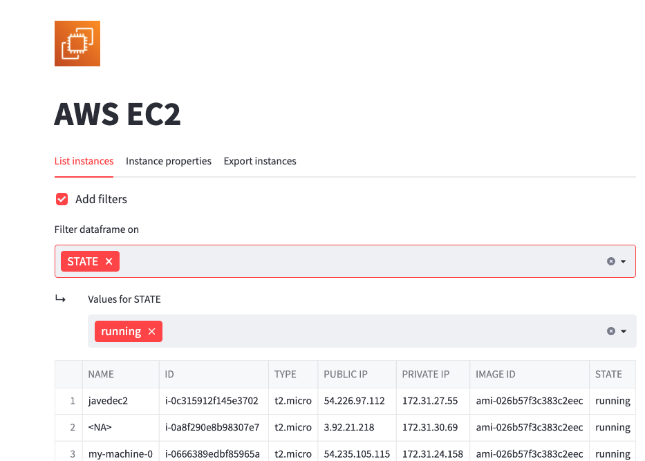

### About The Project & Motivation

AWS Streamlit console has been created as a proof of concept with the goal of learning Streamlit and data visualization using Python.

It is a small tool to explore the resources in AWS Cloud using your customized console.

The idea is that you get all of Streamline ability to create Dashboards, customized consoles like AWS or VMware. 

The code here is not perfect, remember it is a simple repo to explore What I can do with this tool.

I already have in my mind a lot of use cases for this incredible combination of Streamlit and Python.

<p align="center">

</p> 


<!-- GETTING STARTED -->
## Getting Started

This toos is written in Python, and it works in Python 3.x.

### Prerequisites

2) Set your AWS credentials:

```shell
export AWS_ACCESS_KEY_ID="XXXXXXXXX"
export AWS_SECRET_ACCESS_KEY="XXXXXXXXX"
export AWS_DEFAULT_REGION="us-east-1"

```

### Installation

Using virtual environment:

```shell
# clone the repo
git clone
cd /
# Create virtual environment
python3 -m venv ./venv && source venv/bin/activate
# Install pre-reqs for 
pip install -r requirements.txt
#Run cloud explorer
python 
```

## Contributing

Contributions are what make the open source community such an amazing place to be learn, inspire, and create. Any contributions you make are **greatly appreciated**.

1. Fork the Project
2. Create your Feature Branch (`git checkout -b feature/AmazingFeature`)
3. Commit your Changes (`git commit -m 'Add some AmazingFeature'`)
4. Push to the Branch (`git push origin feature/AmazingFeature`)
5. Open a Pull Request

<!-- LICENSE -->
## License

Distributed under Open Source (GPL-3.0)

## If you like it & Feedback

Feel free to send me an email with your feedback or open an issue. Feature requests are always welcome.

This personal project is open source (GPL-3.0), and I took me (and take me.) some time and efforts to design, to code, to make some researches and to test it in my personal AWS account. 

<!-- CONTACT -->
## Contact

Teadeveloper
:email: teadeveloper75@gmail.com


